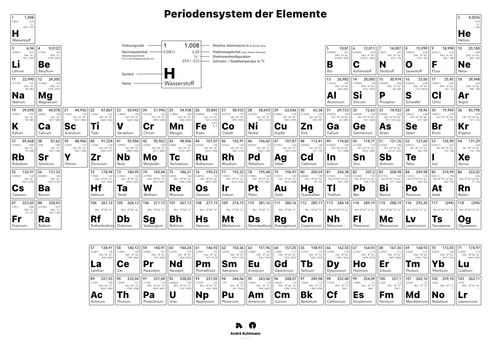

# ⚛ Periodensystem der Elemente

## 🌈 Farbig

## 🔲 Schwarzweiß

## 🛡 Disclaimer
Ich hafte für keinerlei Fehler die durch die Verwendung des Periodensystems entstehen können. Bei Fehlern bitte einen neuen Issue posten.

